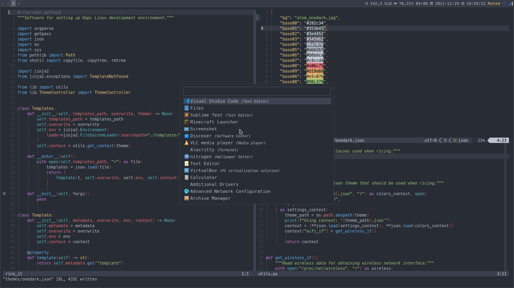

# Ricer

Manager for stream lining color schemes across applications by utilizing Jinja2 templates.

Themes are defined according to Chris Kempsons [Base16 framework](https://github.com/chriskempson/base16).

## Templates

Are stored under `./templates/` and will be rendered with colors set in `./themes/`.
How the templates will be renedred is configured in `./templates.json`.

## Commands

The user has the possibility to automate the setup of ones envrionemnt.
This is done by declaring commands, one per line, in `./commands.txt`.

## Base 16

Base16 aims to group similar language constructs with a single color.
For example, floats, ints, and doubles would belong to the same colour group.
The colors for the default theme were chosen to be separable,
but scheme designers should pick whichever colours they desire,
e.g. `base0B` (green by default) could be replaced with red.
There are some general guidelines below that stipulate which `base0B` should be used to
highlight each construct when designing templates for editors.

Since describing syntax highlighting can be tricky, please see base16-vim and base16-textmate for reference.
Though it should be noted that each editor will have some discrepancies due the fact that
editors generally have different syntax highlighting engines.

Colors `base00` to `base07` are typically variations of a shade and run from darkest to lightest.base
These colors are used for foreground and background, status bars, line highlighting and such.
Colors `base08` to `base0F` are typically individual colors used for types, operators, names and variables.
To create a dark theme, colors `base00` to `base07` should span from dark to light.
For a light theme, these colours should span from light to dark.

    base00 - Default Background
    base01 - Lighter Background (Used for status bars)
    base02 - Selection Background
    base03 - Comments, Invisibles, Line Highlighting
    base04 - Dark Foreground (Used for status bars)
    base05 - Default Foreground, Caret, Delimiters, Operators
    base06 - Light Foreground
    base07 - Light Background
    base08 - Variables, XML Tags, Markup Link Text, Markup Lists, Diff Deleted
    base09 - Integers, Boolean, Constants, XML Attributes, Markup Link Url
    base0A - Classes, Markup Bold, Search Text Background
    base0B - Strings, Inherited Class, Markup Code, Diff Inserted
    base0C - Support, Regular Expressions, Escape Characters, Markup Quotes
    base0D - Functions, Methods, Attribute IDs, Headings
    base0E - Keywords, Storage, Selector, Markup Italic, Diff Changed
    base0F - Deprecated, Opening/Closing Embedded Language Tags, e.g. <?php ?>

## Samples

### Onedark

